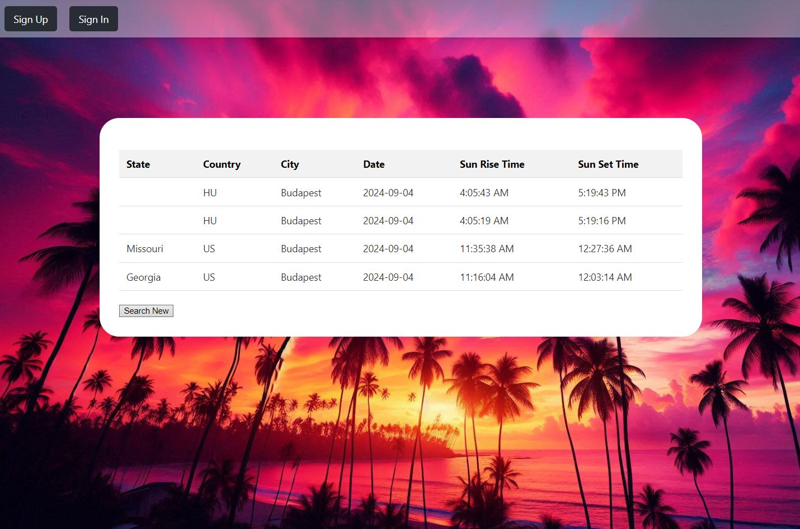
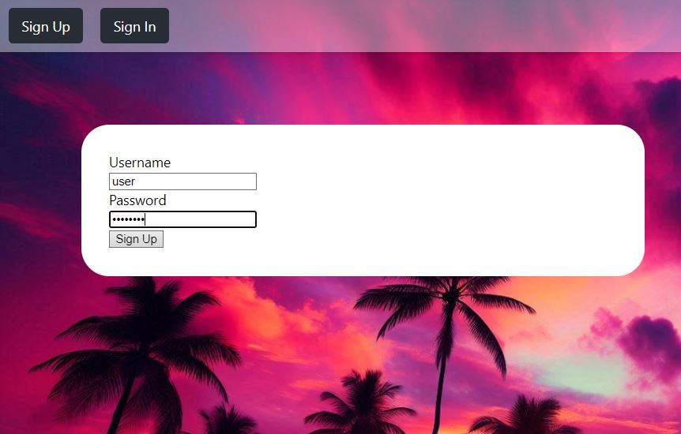
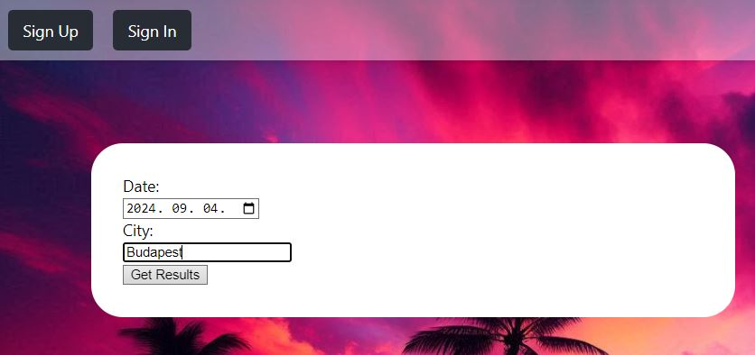
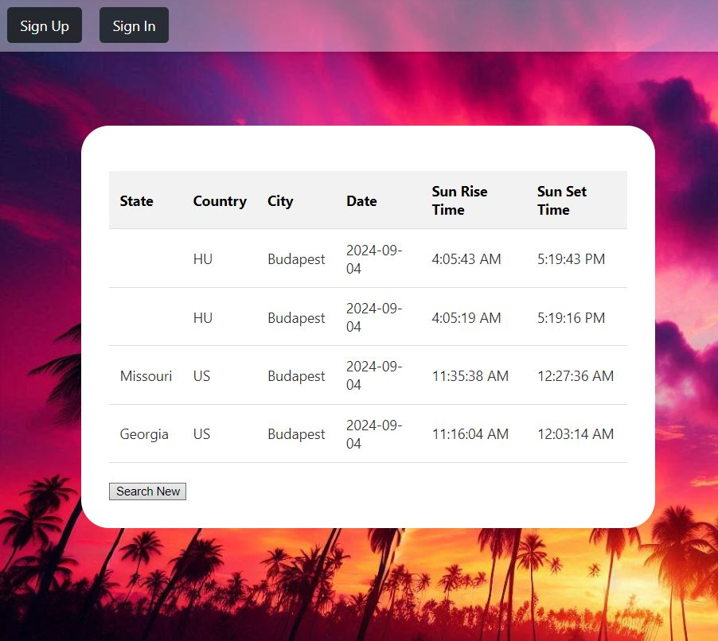

# Solar Watch - get sunset, sunrise time of cities

## What is Solar Watch?

In Solar Watch users can select a date and a city and they get sunrise and sunset time results based on their input. Only registered loged in users can use the page's function.

## Main features

- Register a user
- Login
- Get data with user input

## Technologies
- Frontend: MyReactApp, Vanilla CSS
- Backend: Spring Boot with Spring Data JPA and Spring Security
- Database: PostgreSQL

## Developers
- [Péter Zsigri](https://github.com/ZsigriPeter)

## How to run this app?
### Prerequisites

Ensure the following are installed on your computer:
- Java 17
- Maven 3.9+
- Docker
- PostgreSQL
- Node.js and npm (for the frontend)

### Installation
To set up the project locally:

[//]: # (TODO - Check correctness of text below)
## How to use?  
- Register a new user: select the "Sign Up" tab and fill the required fields, then click Sign Up.
- Then Go to "Sign In", use the username / password combination given by you in the previous step

- After logging in you can access the main part of the page.

- Pick a date and a city to get the result you are looking for.

