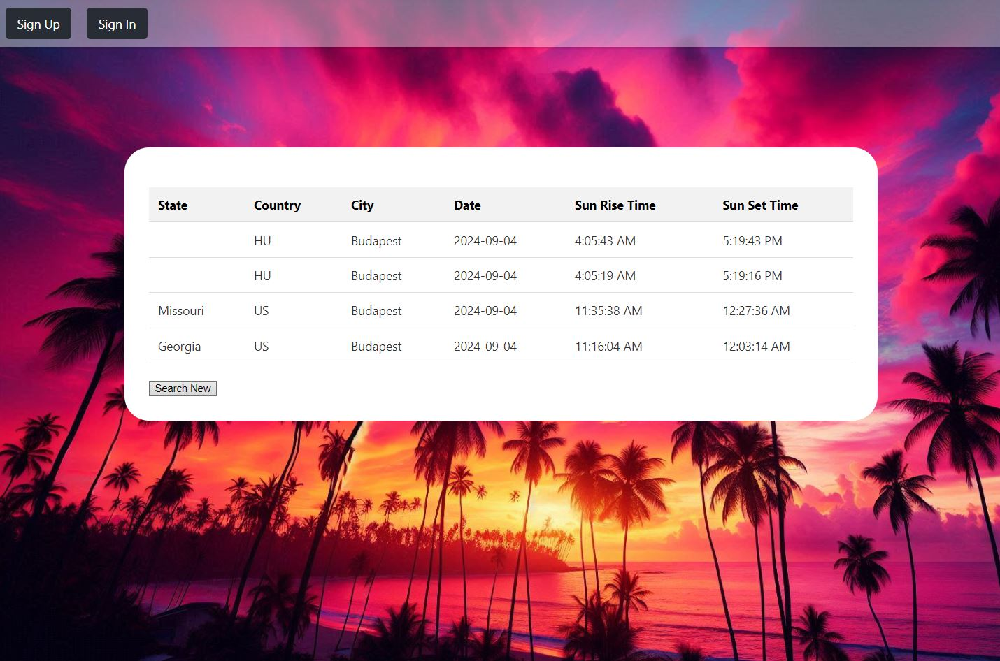
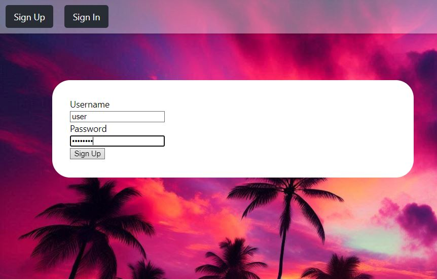
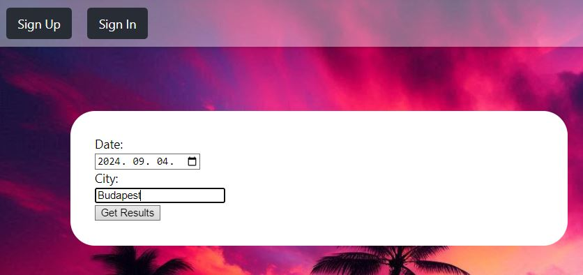
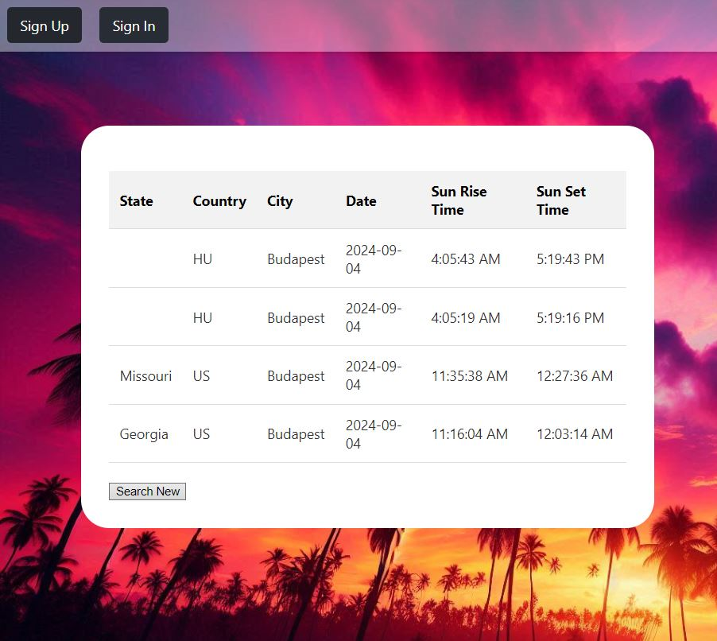

# Solar Watch - get sunset, sunrise time of cities

## What is Solar Watch?

In Solar Watch users can select a date and a city and they get sunrise and sunset time results based on their input. Only registered loged in users can use the page's function.

## Main features

- Register a user
- Login
- Get data with user input

## Technologies
- [![React]][React-url] [![Vite]][Vite-url] [![JavaScript]][JavaScript-url]
- [![CSS]][CSS-url]
- [![Spring-Boot]][Spring-Boot-url] [![Java]][Java-url]
- [![Postgres]][Postgres-url]
- [![IntelliJ-IDEA]][IntelliJ-IDEA-url]

## Developers
- [Péter Zsigri](https://github.com/ZsigriPeter)

## How to run this app?
### Prerequisites

Ensure the following are installed on your computer:
- Java 17
- Maven 3.9+
- Docker (for Dockerised usage)
- PostgreSQL
- Node.js and npm (for the frontend)

### Installation
To set up the project locally:
- clone to local machine
- Docker:
  - navigate to root directory
  - `compose up`
  - Open http://localhost:3000 in browser
- Without Docker:
  - navigate to root directory
  - `cd backend`
  - `mvn clean package -DskipTests`
  - `java -jar target/solar-watch-0.0.1-SNAPSHOT.jar`
  - open new cmd
  - navigate to root directory
  - `cd frontend`
  - `npm start`
  - open link in browser

## How to use?  
- Register a new user: select the "Sign Up" tab and fill the required fields, then click Sign Up.
- Then Go to "Sign In", use the username / password combination given by you in the previous step

- After logging in you can access the main part of the page.

- Pick a date and a city to get the result you are looking for.

